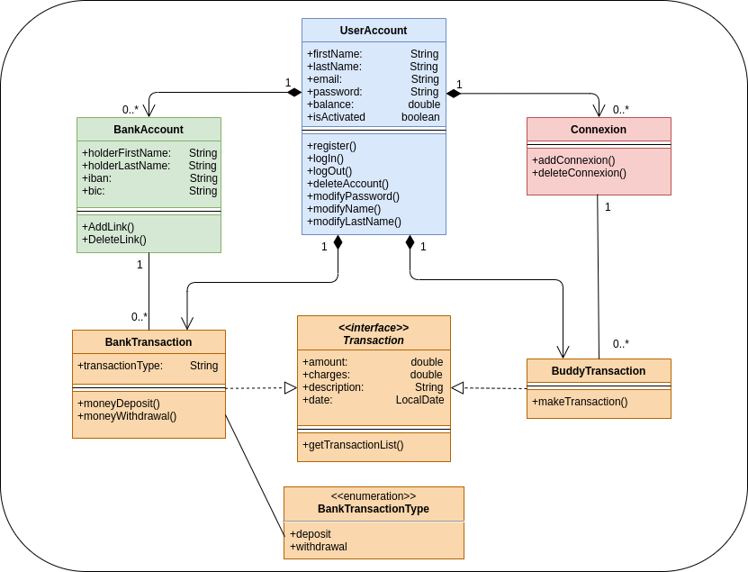

The purpose of this application is to allow customers to transfer money to manage their finances or pay their friends.<br/>
The user is able to register his bank account, transfer money to the application and 
transfer money to the accounts of others application users.

This version is a prototype intended for a first presentation.<br/>
All the functionalities are not present and the interface aims to present the general operation of the application.

<h2>Built with </h2>

- java 11 (object oriented programming language ) <br/> https://www.oracle.com/java/technologies/javase-jdk11-downloads.html
- Vaadin Flow 14.6.6 (Java web framework) <br/> https://vaadin.com/docs/v14/flow/overview
- Apache Maven 3.6.3 (Java project management ) <br/> http://maven.apache.org/
- Spring Boot <br/> https://spring.io/projects/spring-boot
- Spring Web (build web,uses Apache Tomcat as the default embedded container) <br/> https://mvnrepository.com/artifact/org.springframework/spring-web
- Spring Data Jpa (implement JPA based repositories) <br/> https://spring.io/projects/spring-data-jpa
- Spring Security (access-control framework) <br/> https://spring.io/projects/spring-security
- PostgreSQL (object-relational database system) <br/> https://www.postgresql.org/
- Jasypt (library, Java simplified Encryption) <br/> http://www.jasypt.org/
- JUnit Jupiter (execution of tests) <br/> https://mvnrepository.com/artifact/org.junit.jupiter/junit-jupiter-api
- Lombok (Java annotation library which helps to reduce boilerplate code) <br/> https://mvnrepository.com/artifact/org.projectlombok/lombok

<h2>Installation and Getting Started</h2>
<h3>Requirements</h3>

- Java 11
- Maven 3.6.3
- PostgresSQL

<h3>Installation</h3>

1. Clone this repo
   ```shell
   git clone https://github.com/G-jonathan/PayMyBuddy.git

2. Package the application
   ```shell
   mvn package

3. Configure the database on your system <br/>
(database access logs can be modified in the application.properties file)
   ```shell
   execute the src/main/resources/SQL_Scripts/database_creation_script.sql
   
4. Execute the Jar
   ```shell
   java -jar ./target/paymybuddy-0.0.1-SNAPSHOT.jar

5. You can now access the application at localhost:8080/login

<h2>UML class diagram</h2>



<h2>Physical data model </h2>


<h2>SQL database creation script </h2>

   ```shell
   
   
   CREATE TABLE public.user_Account (
    email        VARCHAR(254)         NOT NULL,
    first_name   VARCHAR(255)         NOT NULL,
    last_name    VARCHAR(255)         NOT NULL,
    password     VARCHAR(100)         NOT NULL,
    balance      NUMERIC(6, 2)        NOT NULL,
    is_activated BOOLEAN DEFAULT true NOT NULL,
    CONSTRAINT user_account_pk PRIMARY KEY (email)
);

CREATE TABLE public.authorities (
    email     VARCHAR(254) NOT NULL,
    authority VARCHAR(50)  NOT NULL,
    CONSTRAINT authorities_pk PRIMARY KEY (email)
);

CREATE SEQUENCE public.bank_account_id_seq;

CREATE TABLE public.bank_account (
    id                 INTEGER      NOT NULL DEFAULT nextval('public.bank_account_id_seq'),
    holder_first_name  VARCHAR(255) NOT NULL,
    holder_last_name   VARCHAR(255) NOT NULL,
    iban               VARCHAR(31)  NOT NULL,
    bic                VARCHAR(11)  NOT NULL,
    user_account_email VARCHAR(254) NOT NULL,
    CONSTRAINT bank_account_pk PRIMARY KEY (id)
);

ALTER SEQUENCE public.bank_account_id_seq OWNED BY public.bank_account.id;

CREATE SEQUENCE public.bank_transaction_id_seq;

CREATE TABLE public.bank_transaction (
    id                 INTEGER       NOT NULL DEFAULT nextval('public.bank_transaction_id_seq'),
    amount             NUMERIC(6, 2) NOT NULL,
    charges            NUMERIC(4, 2) NOT NULL,
    description        VARCHAR(255)  NOT NULL,
    date               DATE          NOT NULL,
    transaction_type   VARCHAR(10)   NOT NULL,
    bank_account_id    INTEGER       NOT NULL,
    user_account_email VARCHAR(254)  NOT NULL,
    CONSTRAINT bank_transaction_pk PRIMARY KEY (id)
);

ALTER SEQUENCE public.bank_transaction_id_seq OWNED BY public.bank_transaction.id;

CREATE SEQUENCE public.connexion_id_seq;

CREATE TABLE public.connexion (
    id                 INTEGER      NOT NULL DEFAULT nextval('public.connexion_id_seq'),
    user_account_email VARCHAR(254) NOT NULL,
    connexion_email    VARCHAR(254) NOT NULL,
    CONSTRAINT connexion_pk PRIMARY KEY (id)
);

ALTER SEQUENCE public.connexion_id_seq OWNED BY public.connexion.id;

CREATE SEQUENCE public.buddy_transaction_id_seq;

CREATE TABLE public.buddy_transaction (
    id                 INTEGER       NOT NULL DEFAULT nextval('public.buddy_transaction_id_seq'),
    amount             NUMERIC(6, 2) NOT NULL,
    charges            NUMERIC(4, 2) NOT NULL,
    description        VARCHAR(255)  NOT NULL,
    date               DATE          NOT NULL,
    user_account_email VARCHAR(254)  NOT NULL,
    connexion_id       INTEGER       NOT NULL,
    CONSTRAINT buddy_transaction_pk PRIMARY KEY (id)
);

ALTER SEQUENCE public.buddy_transaction_id_seq OWNED BY public.buddy_transaction.id;

ALTER TABLE public.connexion
    ADD CONSTRAINT user_account_connexion_fk
        FOREIGN KEY (user_account_email)
            REFERENCES public.user_Account (email)
            ON DELETE NO ACTION
            ON UPDATE NO ACTION
            NOT DEFERRABLE;

ALTER TABLE public.connexion
    ADD CONSTRAINT user_account_connexion_fk1
        FOREIGN KEY (connexion_email)
            REFERENCES public.user_Account (email)
            ON DELETE NO ACTION
            ON UPDATE NO ACTION
            NOT DEFERRABLE;

ALTER TABLE public.bank_account
    ADD CONSTRAINT user_account_bank_account_fk
        FOREIGN KEY (user_account_email)
            REFERENCES public.user_Account (email)
            ON DELETE NO ACTION
            ON UPDATE NO ACTION
            NOT DEFERRABLE;

ALTER TABLE public.bank_transaction
    ADD CONSTRAINT user_account_bank_transaction_fk
        FOREIGN KEY (user_account_email)
            REFERENCES public.user_Account (email)
            ON DELETE NO ACTION
            ON UPDATE NO ACTION
            NOT DEFERRABLE;

ALTER TABLE public.buddy_transaction
    ADD CONSTRAINT user_account_buddy_transaction_fk
        FOREIGN KEY (user_account_email)
            REFERENCES public.user_Account (email)
            ON DELETE NO ACTION
            ON UPDATE NO ACTION
            NOT DEFERRABLE;

ALTER TABLE public.authorities ADD CONSTRAINT user_account_authorities_fk
    FOREIGN KEY (email)
        REFERENCES public.user_Account (email)
        ON DELETE NO ACTION
        ON UPDATE NO ACTION
        NOT DEFERRABLE;

ALTER TABLE public.bank_transaction
    ADD CONSTRAINT bank_account_bank_transaction_fk
        FOREIGN KEY (bank_account_id)
            REFERENCES public.bank_account (id)
            ON DELETE NO ACTION
            ON UPDATE NO ACTION
            NOT DEFERRABLE;

ALTER TABLE public.buddy_transaction
    ADD CONSTRAINT connexion_buddy_transaction_fk
        FOREIGN KEY (connexion_id)
            REFERENCES public.connexion (id)
            ON DELETE NO ACTION
            ON UPDATE NO ACTION
            NOT DEFERRABLE; 
```

<h2>Insertion data script example</h2>

```shell

INSERT INTO user_account
VALUES ('user1@email.com', 'user1FirstName', 'user1LastName', 'user1Password', 100, true),
       ('user2@email.com', 'user2FirstName', 'user2LastName', 'user2Password', 100, true),
       ('user3@email.com', 'user3FirstName', 'user3LastName', 'user3Password', 100, true),
       ('user4@email.com', 'user4FirstName', 'user4LastName', 'user4Password', 100, true),
       ('user5@email.com', 'user5FirstName', 'user5LastName', 'user5Password', 100, true)
;
INSERT INTO authorities
VALUES ('user1@email.com', 'ROLE_USER'),
       ('user2@email.com', 'ROLE_USER'),
       ('user3@email.com', 'ROLE_USER'),
       ('user4@email.com', 'ROLE_USER'),
       ('user5@email.com', 'ROLE_USER')
;
INSERT INTO connexion (user_account_email, connexion_email)
VALUES ('user1@email.com', 'user2@email.com'),
       ('user1@email.com', 'user3@email.com'),
       ('user2@email.com', 'user3@email.com')
;
INSERT INTO buddy_transaction (amount, charges, description, date, user_account_email, connexion_id)
VALUES (10, 0, 'payment of 10 euros to user2FirstName user2LastName', CURRENT_DATE, 'user1@email.com',
        (SELECT id from connexion WHERE user_account_email = 'user1@email.com' AND connexion_email = 'user2@email.com')),
       (5, 0, 'payment of 5 euros to user3FirstName user3LastName', CURRENT_DATE, 'user1@email.com',
        (SELECT id from connexion WHERE user_account_email = 'user1@email.com' AND connexion_email = 'user3@email.com'))
       (25, 0, 'payment of 25 euros to user3FirstName user3LastName', CURRENT_DATE, 'user2@email.com',
        (SELECT id from connexion WHERE user_account_email = 'user2@email.com' AND connexion_email = 'user3@email.com'))
;

```